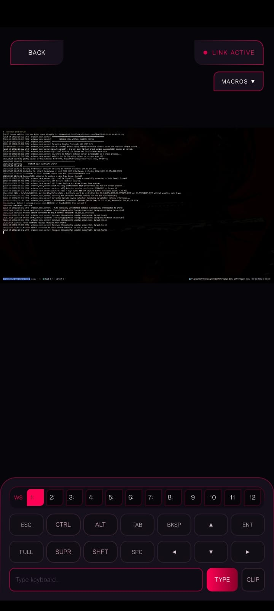
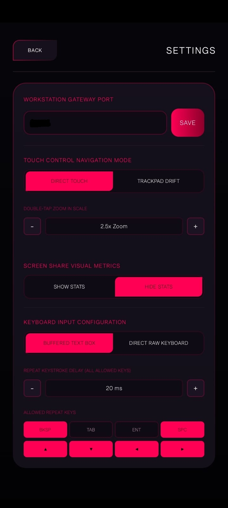
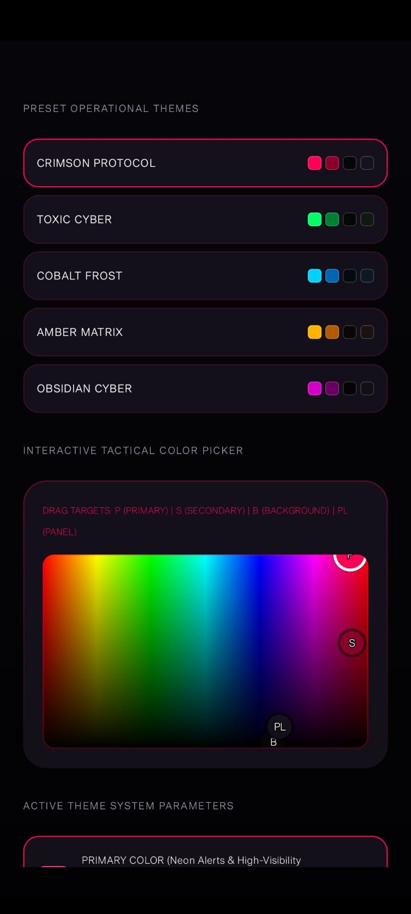
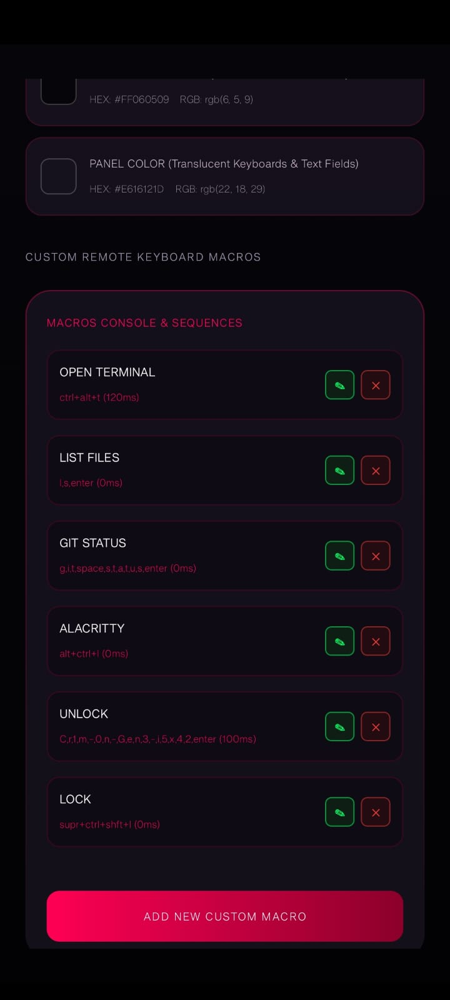
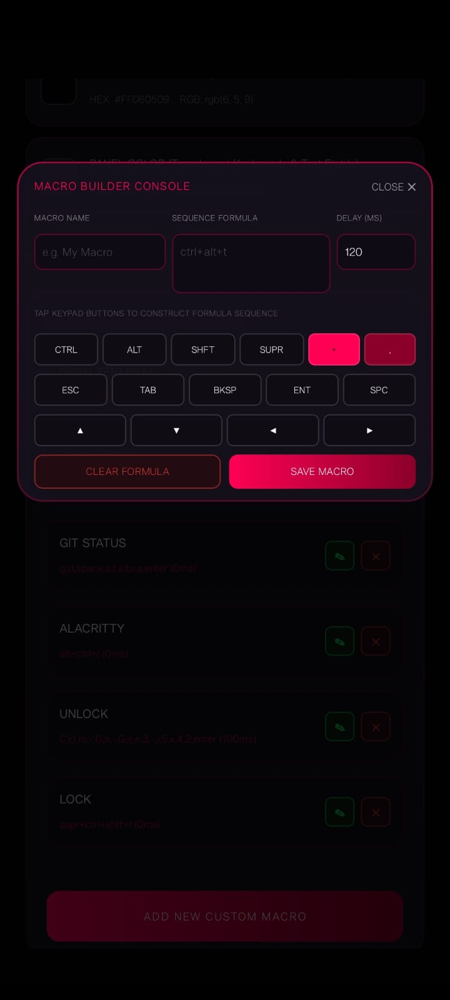

# NyxFrame — Aggregated Documentation

This file aggregates all documentation pages from the `docs/` directory into a single file for easy reference.

---

---

## docs/Home.md

# NyxFrame (nyxframe) Wiki Home

Welcome to the NyxFrame (nyxframe) GitLab Wiki. This project is a high-performance, low-latency remote control and developer companion system. It enables developers and power users to control Arch Linux workstations (supporting both X11 and Wayland) directly from a physical Android device at 60 FPS with sub-frame latency.

---

## docs/Getting-Started.md

# GitLab Wiki: Getting Started

This guide details how to build, install, and execute the NyxFrame (`nyxframe`) remote control environment on your Linux host workstation and Android companion device.

---

## docs/Getting-Started.md (full)

## 1. Host Workstation Installation

The workstation server is divided into a high-performance Rust systems engine (`nyxframe-server`) and a concurrent Go network signaling gateway. It supports both traditional **X11** and modern **Wayland** display compositors.

### A. Install System Dependencies
Install the required packages using your system package manager. On Arch Linux, execute:

```bash
# 1. Install developer toolchains and compiler runtimes
sudo pacman -S base-devel go rust adb

# 2. Install command utilities and clipboard sharing
sudo pacman -S xdotool xclip libxcb

# 3. Add your active standard user to the adbusers group for USB debugging permissions
sudo usermod -aG adbusers $USER

# 4. Enable and start the ADB system daemon
sudo systemctl enable --now adb
```

The Rust release build links against native XCB libraries, so the unversioned development package must be present on the host. On Debian/Ubuntu, install `libxcb1-dev` and `libxcb-shm0-dev` before running the build.

For the Android release app on Debian/Ubuntu, avoid installing the `android-sdk` meta-package together with Google build-tools installers. That combination pulls Debian's `aapt`, which conflicts with `google-android-build-tools-34.0.0-installer`. Install the platform and build-tools packages directly instead:

```bash
sudo apt install google-android-platform-34-installer google-android-build-tools-34.0.0-installer sdkmanager
```

### B. Configure Host Compositor Settings
Open the server configuration file at [server/config.json](server/config.json) to set your active window manager commands:

* **For X11 (i3wm)**:
	Configure `window_manager_cmd` to target `i3-msg`:
	```json
	{
		"network_port": "9090",
		"uds_socket_path": "/tmp/nyxframe.sock",
		"window_manager_cmd": "i3-msg"
	}
	```
* **For Wayland (Sway)**:
	Configure `window_manager_cmd` to target `swaymsg` to route commands over Wayland PipeWire portals natively:
	```json
	{
		"network_port": "9090",
		"uds_socket_path": "/tmp/nyxframe.sock",
		"window_manager_cmd": "swaymsg"
	}
	```

---

## docs/Getting-Started.md (continued)

---

## 2. Building & Running the Host Server

### A. Compile the Server Binaries
Use the built-in workspace compilation script to compile both the Rust engine and the Go gateway:

```bash
# Compile and package optimized release binaries
./build_server.sh release
```
* **Output Path**: The script compiles the binaries and automatically copies the optimized systems engine to the root directory as **`nyxframe-server`**.
* **Hot Rebuilds**: The Rust engine dynamically monitors the Go gateway code (`server/go/main.go`) and automatically recompiles it at startup if any newer changes are detected on disk.

### B. Launching in X11 Mode
X11 capture leverages the ultra-low latency **MIT-SHM (Shared Memory)** extension to grab full screen frame buffers in under 3ms.

1. **Verify Session Environment**:
	 Ensure you are logged into your active X11 user session. Verify your active display pointer:
	 ```bash
	 echo $DISPLAY # Should output :0
	 ```
2. **Execute the Daemon**:
	 Launch the compiled binary with standard root privileges (required for virtual system keyboard/mouse emulations under `/dev/uinput`):
	 ```bash
	 sudo ./nyxframe-server
	 ```
	 * *Note: The Rust engine automatically captures your active user context (`SUDO_UID` and `SUDO_GID`) and drops privileges to run the Go gateway as your standard user, ensuring secure X11 authority (`.Xauthority`) authentication.*

### C. Launching in Wayland Mode
Wayland capture utilizes modern **PipeWire** portal APIs to grab display frame buffers securely under compositors like Sway.

1. **Execute the Daemon**:
	 Launch the compiled binary with the Wayland flag:
	 ```bash
	 sudo ./nyxframe-server --wayland
	 ```
2. **Monitor Server Log Outputs**:
	 All log streams are written relative to the execution binary at `logs/YYYY-MM-DD_HH-MM-SS.log` containing consolidated events from both the Rust capturer and Go network server.

---

## docs/Getting-Started.md (continued)

---

## 3. Building & Deploying the Android Client

The Android companion application is a Kotlin-based Jetpack Compose client that handles high-speed video rendering directly inside GPU hardware using native Android `MediaCodec` surface decoders.

### A. Prepare Your Android Device
1. Connect your Android phone to your workstation via a USB cable.
2. Navigate to **Settings > About Phone** and tap **Build Number** seven times to enable **Developer Options**.
3. Go to **Developer Options** and enable **USB Debugging**.
4. Keep the device screen unlocked and approve the **USB Debugging Authorization Dialog** when prompted.

### B. Compile and Install over USB
Deploy the application directly to your phone with a single workspace script:

```bash
# Compile and install the optimized release app directly on the connected phone
./build_and_install_android.sh release
```
* **Java 26 Compatibility**: The build script automatically overrides `JAVA_HOME` to target JDK 17 (scanning `~/jdk17` and local OpenJDK paths), bypassing compiler failures under newer system-default Java 26 runtimes.
* **Release Signing Key Parity**: The Gradle script signs the release build using local debug signatures. This generates the `installRelease` task and allows ADB to push the optimized release package straight to the USB-connected phone without signing conflicts.
* **APK Backups**: A standalone copy of the compiled installer package is backed up to the project root directory using the current version name, such as **`nyxframe-2.1-release.apk`**.

### App Home Screen Preview
Once deployed, the app boots into a premium cyberpunk interface capable of scanning your local subnet and Tailscale MagicDNS connections automatically:


---

## docs/Getting-Started.md (continued)

---

## 4. Launching the App & Establishing a Connection

1. Open the **NyxFrame** application from your phone's app drawer (identified by the custom deep-obsidian and neon-nyxframe hexagonal logo).
2. Ensure both the phone and the workstation are on the same local Wi-Fi network (or linked via a active Tailscale VPN tunnel).
3. **Auto-Discovery**:
	 The home screen will automatically scan your local `/24` Wi-Fi subnet, MagicDNS namespaces (`nyxframe`, `nyxframe.tailscale.net`), and persistent history lists to discover the active workstation.
4. **Establish the Link**:
	 Select your discovered workstation from the carousel or manually input its IP/Hostname, and tap **CONNECT**.
5. **Silky-Smooth 60 FPS Viewport**:
	 * The app will transition to the high-performance viewing canvas, instantly pulling an H.264 I-frame the moment the TextureView surface becomes active.
	 * Pressing the system back gesture will cleanly tear down the video stream socket, stopping server capture encoding and providing **silky-smooth, lag-free back navigation transitions**.

---

## docs/Getting-Started.md (continued)

---

## 5. Visual Interface Showcase

### Live Remote Viewport & Control Canvas
The high-performance video renderer displays your workstation screen in real-time, coupled with an ergonomic capsular floating control toolbar (containing zero-pivot zoom reset, tactical cursor locking, arrow pads, and macro dropdown lists):



### Custom Configuration & Reactive Theme Engine
The Settings dashboard provides dynamic gateway port customization, relative trackpad vs direct touch controls, history wipes, and a custom **2D Hue-Value Canvas Color Picker** to construct personalized cyberpunk interfaces reactively:




### Macro Sequences & Keypad Builder
Build and persistent-sync complex automated keystroke formulas in YAML/TOML/JSON, selecting exact key combinations, uppercase modifiers, and custom execution delays in a single compact interface:




### High-Speed Workspace File Transfer
Tap and establish dynamic HTTP upload/download connections over secure lanes, tracking transfer progress in real-time logs while exchanging full directories and system files:


---

## docs/Video-Streaming-Engine.md (full)

# GitLab Wiki: Video Streaming Engine

NyxFrame (nyxframe) achieves a smooth, real-time 60 FPS remote desktop feed over local and Tailscale networks by orchestrating custom capture pipelines, high-performance encoders, and native Android GPU rendering.

---

## 1. High-Performance Screen Capture

The Rust systems engine contains dual capture modules selected dynamically based on your display server environment.

### A. X11 Capture (MIT-SHM)
When targeting standard X11 environments, the capturer utilizes the MIT Shared Memory Extension (MIT-SHM) through safe Rust `xcb` bindings:
* **Mechanism**: Rather than copying pixels across process boundaries via standard network sockets, the X11 server and Rust engine share a mapped segment of system RAM (SHM segment).
* **Speed**: Screen capture times are cut to less than 2 milliseconds for a full 1080p display, completely avoiding memory-copying overhead.

### B. Wayland Capture (PipeWire Portals)
When booted with the `--wayland` flag, the capturer links directly to the PipeWire multimedia pipeline:
* **Mechanism**: Leverages low-latency screen sharing portals to capture desktop composition streams natively from the Wayland compositor.
* **Format**: Captures high-frequency buffer segments directly into system memory, ensuring compatibility with modern Linux compositors.

---

## 2. Low-Latency H.264 Video Compression

Raw 1080p video frames require massive bandwidth (around 500 MB/s at 60 FPS), which would congest network links immediately. The system implements highly optimized video encoding pipelines to shrink payloads.

### A. SIMD-Accelerated YUV420p Converter
H.264 video encoders require raw input frames in the YUV420p pixel format rather than standard RGB/BGRA.
* **Problem**: Standard float-point conversion matrices require significant CPU overhead, creating processing bottlenecks.
* **Solution**: Implemented an optimized integer-based YUV conversion buffer (`FullRangeYUVBuffer`) using fast bit-shifting operations:
	* `Y = ((77 * R + 150 * G + 29 * B) >> 8)`
	* `U` and `V` values are subsampled from 2x2 blocks of RGB pixels.
	* This structure enables compilers to leverage SIMD (AVX2/AVX-512) auto-vectorization, dropping full conversion times from 18ms down to less than 3 milliseconds.

### B. Dual Compression Profiles

#### Software Mode (OpenH264)
* Uses the Cisco `openh264` library compiled natively into the Rust engine.
* Configured with low-complexity parameters, a high target bitrate of 5 Mbps, and disabled frame-skipping (`enable_skip_frame(false)`) to guarantee a smooth, continuous frame feed.

#### Hardware Mode (NVIDIA NVENC)
* Automatically checks for NVIDIA graphics cards and launches an optimized, low-latency FFmpeg process utilizing `-c:v h264_nvenc`.
* **Bitrate and Rate Control**: Employs constant bitrate low delay rate control (`-rc cbr_ld_hq`) to eliminate latency spikes during high-motion frames:
	* Target Bitrate: 3 Mbps (`-b:v 3M`)
	* Maximum Bitrate: 4 Mbps (`-maxrate 4M`)
	* Small Buffer Size: 256 KB (`-bufsize 256K`) to prevent buffer queues.
	* Extended Keyframe Interval: Scaled to 300 frames (5 seconds) to prevent heavy periodic network bursts from I-frames.

---

## 3. Drift-Compensated Pacing

To maintain an exact 60 FPS capture loop without drifts or accumulation lag, the Rust engine implements a drift-compensated pacing algorithm:
* Rather than sleeping for a static 16.6ms, the loop dynamically measures the exact processing time of the current frame (capture, YUV convert, compress, and send).
* Subtracts this processing time from the target frame budget (16,666 microseconds) and sleeps for the precise remaining duration.
* If a frame takes longer than 16.6ms, the pacing compensation reduces subsequent sleep cycles to catch up immediately, ensuring clock-accurate 60 FPS output.

---

## 4. GPU-Driven Surface Rendering (Android)

On the Android companion device, raw H.264 byte streams are parsed and decoded entirely inside the mobile device's graphics hardware.

```
Incoming WebSockets H.264 Stream
						 │
						 ▼
	 Kotlin WebSocketManager
						 │
						 ▼
	 H264Decoder (MediaCodec)
						 │ (Direct Hardware Pipe)
						 ▼
	Android GPU Graphics Memory
						 │
						 ▼
		TextureView Surface
	(Direct GPU Display Render)
```

### A. Zero-Copy MediaCodec Decoder
* Incoming H.264 byte segments are pushed straight into the native Android `MediaCodec` decoder queue inside a specialized background coroutine thread.
* **Surface Decoding**: The decoder is bound directly to an Android system `Surface`. The hardware decoder writes decoded pixel buffers directly to GPU texture memory.
* **Zero CPU Copy**: Decoded pixels never traverse back to JVM heap memory, dropping CPU consumption on the phone to nearly zero.

### B. Hardware-Accelerated Rendering View
* The streaming canvas is implemented inside Jetpack Compose using an Android `TextureView`.
* Hardware-decoded GPU texture buffers are drawn directly on the screen by the mobile device's graphics processor.
* This architecture ensures lag-free rendering at a solid, stable 60 FPS while keeping the phone cool and preserving battery life.

### High-Performance Remote Viewport Canvas
The GPU-driven renderer maps video streams onto a sleek tactical canvas featuring zoom controls and action buttons:


---

## docs/System-Architecture.md (full)

# GitLab Wiki: System Architecture

NyxFrame (nyxframe) implements a robust, secure, multi-process architecture to decouple high-privilege systems interactions from low-privilege network inputs.

---

## 1. Multi-Process Division of Labor

The host architecture consists of two cooperative servers:

```
+--------------------------------------------------------------+
|                     Workstation Host                         |
|                                                              |
|   +--------------------------+    +----------------------+   |
|   |       Rust Engine        |    |      Go Gateway      |   |
|   |  (Privileged/Root Daemon)|    |   (Standard User)    |   |
|   +-------------+------------+    +-----------+----------+   |
|                 |                             |              |
|                 |     Unix Domain Socket      |              |
|                 +=====> /tmp/nyxframe.sock <====+              |
|                               |                              |
|                               v                              |
|                      WebSocket Interface                     |
|                      (JSON & Binary data)                    |
|                               |                              |
+-------------------------------|------------------------------+
																|
																v
											+-------------------+
											|   Android Phone   |
											|   (Kotlin Client) |
											+-------------------+
```

### A. The Rust Systems Engine (`nyxframe-server`)
* **Role**: Primary orchestrator, low-level screen capture driver (MIT-SHM or PipeWire), and virtual input emulator.
* **Privileges**: Booted with root privileges (required to interact directly with `/dev/uinput` and PipeWire system session portals).
* **Process Security**:
	* **Privilege Dropping**: Once started, the Rust daemon drops its process execution credentials to spawn the Go gateway server under the standard user's UID and GID (parsed from `SUDO_UID` and `SUDO_GID`).
	* **Environment Isolation**: Configures standard user environments (`HOME`, `USER`, `DISPLAY=:0`, and `XAUTHORITY`) before spawning the gateway, ensuring the Go process can interact with X11 displays and user config directories.

### B. The Go Network Gateway (`server/go/server`)
* **Role**: High-speed network gateway, REST API platform, and secure WebSocket server.
* **Privileges**: Runs under standard user privileges.
* **Responsibilities**:
	* Exposes port `9090` to listen for network handshakes, settings, and file uploads.
	* Translates incoming WebSocket JSON events into high-performance commands mapped to user-space tools like `xdotool` and `xclip`.
	* Manages high-performance CGO standard image encodings and relays video streams directly down binary WebSocket channels.

---

## 2. Unix Domain Socket Layer (`/tmp/nyxframe.sock`)

The Rust engine and Go gateway communicate locally via a high-speed Unix Domain Socket (`/tmp/nyxframe.sock`) configured with `0666` permission bits to allow cross-privilege communication.

### A. Thread-Safe Socket Splitting
To prevent deadlock conditions under high throughput, the accepted socket connection is split into owned halves:
```rust
let (mut read_half, mut write_half) = stream.into_split();
```
* **Command Task (`read_half`)**: Blocks asynchronously on incoming commands sent from Go, processing input emulation events immediately.
* **Capture Task (`write_half`)**: Streams compressed H.264 video frame buffers to the Go client at a continuous 60 FPS without ever locking the read task.
* **Deadlock Prevention**: Decoupling read/write operations into lock-free stream halves guarantees that high-motion screen updates never starve keyboard/mouse commands.

### B. Frame Stream Byte Protocol (Rust to Go)
Video frames are serialized into binary packets containing a 20-byte big-endian header:
```
+------------------+-------------------+----------------------+--------------------+--------------------+
| Width [0-3 Bytes]| Height [4-7 Bytes]| Timestamp [8-15 Bytes]| Payload [16-19 B]  | Raw Frame Bytes... |
+------------------+-------------------+----------------------+--------------------+--------------------+
```
* **Width**: 4 Bytes (u32)
* **Height**: 4 Bytes (u32)
* **Timestamp**: 8 Bytes (u64)
* **Payload Length**: 4 Bytes (u32)

### C. Command Packet Protocol (Go to Rust)
Command events are serialized as `[Length: u32][JSON Payload]` packets. The length prefix prevents network framing buffer merges:
```json
{
	"type": "key",
	"key_code": 30,
	"pressed": true
}
```

---

## 3. Execution Control & Command Queues
To resolve race conditions and key-repeat bugs from concurrent terminal command execution, the Go gateway leverages a FIFO command pipeline:
* All incoming remote interaction packets are pushed into a thread-safe Go channel (`xdotoolQueue`).
* A single background worker goroutine (`startXdotoolWorker()`) reads from the channel and executes `xdotool` commands sequentially.
* This guarantees that keystroke presses and releases (e.g. `keydown` and `keyup`) are processed in their exact sequential order, eliminating stuck modifier keys.

---

## docs/Input-Emulation.md (full)

# GitLab Wiki: Input Emulation

NyxFrame (nyxframe) mimics mouse, keyboard, clipboard, and desktop environment actions natively on the Linux workstation using pure user-space tools and local desktop IPC.

---

## 1. User-Space Interaction Layer

By using xdotool and xclip in the standard user context, the system emulates hardware interactions cleanly without needing root uinput execution permissions for command processing.

---

## 2. Advanced Touch Pointer Mechanics

The application supports two distinct pointer interaction profiles, configured inside the settings panel.

### A. Absolute touch Mapping
Tapping or dragging on the phone maps your finger's coordinates absolutely to the workstation's screen dimensions.
* **Scale-Aware Coordinate Mapping**: The Go network gateway receives normalized coordinate payloads `(x, y, max_x, max_y)` indicating the finger's position relative to the phone's rendering viewport.
* **Scale Equations**: The Go server queries the active X11/Wayland display boundaries and scales coordinates:
	* `HostX = (x * HostScreenWidth) / max_x`
	* `HostY = (y * HostScreenHeight) / max_y`
* **Absolute Move Execution**: Cursor position is updated instantly using `xdotool mousemove --sync <HostX> <HostY>`.

### B. Relative Panning & Centroid Zooming
* **Centroid Zooming**: When zooming in, the Compose canvas tracks touch gesture centroids to scale viewport transforms smoothly, keeping the image segment under your fingers completely stable.
* **Edge-Locking Clamping**: Clamps panning offsets to prevent the scaled screen from pulling past the canvas borders. The image edges remain locked to the viewport boundaries.
* **Relative Trackpad Control**: Tracks delta movement shifts `(dx, dy)` and translates them into relative cursor motions using `xdotool mousemove_relative -- <dx> <dy>`.

### C. Tactical Cursor & Drag-to-Select Gestures
* **Glowing Target Pointer**: Renders a custom glowing nyxframe target ring with a white core at your active touch location on the phone's canvas. It automatically self-hides after 3 seconds of inactivity to keep the canvas clear.
* **Drag-to-Select Gestures**: Implements click-and-drag mechanics via long-press gestures. Long-pressing maps the cursor position, executes a host mouse down (`mousedown 1`), and streams absolute movements to select regions in real-time, releasing upon lift (`mouseup 1`).

---

## 3. Keyboard Emulation

Keystrokes are converted into physical events on the workstation using scan code translation tables.

### A. Scan Code Translation
* The Go server maps all coming symbol characters and developer control keys to their respective Linux evdev scan codes.
* **Shift-State Symbol Parsing**: Punctuation marks (such as `-`, `_`, `=`, `[`, `]`, `{`, `}`, `;`, `:`, `'`, `"`, `/`, `\`, `.`, `~`, `` ` ``) are dynamically resolved to their base key scan code. For example, the underscore `_` is translated to scan code `12` (the minus key) and paired with an automated Shift key press.
* **Caps-State Combination Injection**: Single uppercase characters trigger automated Shift combinations, and combination operators (e.g. `"ctrl+alt+A"`) resolve capital letters into their base code with the `shift` modifier injected at the front.

### B. Soft Keyboard & BKSP Fixes
* **IME Sync Fix**: Direct Keyboard mode uses Compose `TextFieldValue` tracking to force a single-space character buffer and reset the composition state after each delete. This keeps the soft keyboard's delete key fully enabled and responsive during rapid, consecutive tapping.
* **Repeating Key Actions**: Modifying the delete button (`BKSP`) or allowed keys (such as `TAB`, `ENT`, arrows) using `RepeatingSystemKeyButton` intercepts touch gestures to fire keystroke commands repeatedly after a user-configured delay (20ms default, scale-adjustable inside settings).

---

## 4. Workstation Workspace Control (i3wm IPC Socket)

Rather than simulating complex hotkey combinations, the system commands the i3wm window manager directly via its Unix IPC socket.

```
Phone UI Swipe Gesture / Workspace Button Tap
											 │
											 ▼
			 Go Server (main.go IPC Listener)
											 │
											 ▼
Scans /run/user/1000/i3/ipc-socket.* Unix sockets
											 │
											 ▼
			Sends JSON Command over Unix Socket:
		`i3-msg workspace number <workspace_num>`
```

* **Socket Discovery**: The Go server dynamically scans `/run/user/1000/i3/ipc-socket.*` (and falls back to `/tmp/i3-*.*/ipc-socket.*` structures) to find the active Unix domain IPC socket used by your desktop's i3 window manager.
* **Direct IPC Execution**: When switching workspaces or hitting the **FULL** button, it writes to the socket directly:
	* `i3-msg workspace number <num>`
	* `i3-msg fullscreen toggle`
* **Custom Suffix Parsing**: The use of `workspace number <num>` commands i3wm to switch workspaces using only numerical prefixes, supporting workspace sheets with custom suffixes or icons natively.

---

## docs/Macros-and-Automation.md (full)

# GitLab Wiki: Macros and Automation

NyxFrame (nyxframe) includes a highly flexible keyboard macro sequence executor and backup synchronization engine, allowing users to automate complex terminal commands or workstation hotkeys from the phone.

---

## 1. Non-Blocking Coroutine Macro Executor

Macros are declared as text formulas and executed inside the Android client's background thread using Kotlin Coroutines:
* **Asynchronous Thread Execution**: Prevents macro execution loops from blocking the main UI thread, keeping the video stream and screen shares fully responsive during long keystroke chains.
* **Typing Pace Buffers**: To ensure the Linux workstation's keyboard buffers do not merge rapid inputs, the coroutine worker introduces an adjustable delay (defaulting to 120ms) between sequential actions.

---

## 2. Macro Syntax and Operators

The macro engine parses text formulas using two primary execution operators.

### A. Sequential Actions (Comma Operator `,`)
* **Syntax**: `step_one, step_two, step_three` (e.g. `l, s, enter`).
* **Execution**: Steps are executed sequentially. The engine presses and releases the keys for `step_one`, sleeps for 120ms, and continues down the list.

### B. Concurrent Combinations (Plus Operator `+`)
* **Syntax**: `modifier+key` (e.g. `ctrl+alt+t` or `super+shift+q`).
* **Execution**: Steps are executed concurrently:
	1. Down-clicks are triggered in left-to-right order: `keydown ctrl` $\\rightarrow$ `keydown alt` $\\rightarrow$ `keydown t`.
	2. Release-clicks are triggered in reverse order to mimic natural finger lift: `keyup t` $\\rightarrow$ `keyup alt` $\\rightarrow$ `keyup ctrl`.

---

## 3. UI Macro Builder and Cyberpunk Themes

* **Macro Console Builder**: An ergonomic builder dialog in the Settings screen allows users to test and assemble macros dynamically. Modifier keys can be appended to the active cursor selection via tapping buttons.
* **Custom 2D Color Picker Canvas**: Integrates a highly visual hue-value space canvas displaying saturated neon primary shades, secondary gradients, background layers, and panels. Draggable nodes (`P`, `S`, `B`, `PL`) update configurations persistently in local preferences.
* **Theme Coordination**: Macro creation tools and builder operator badges automatically match the active Cyberpunk theme's accent gradients in real-time.

### Theme Selector and 2D Interactive Canvas
The Settings screen incorporates an advanced 2D Hue-Value Canvas Color Picker to customize cyberpunk accent hues reactively:


### Integrated Sequence Macro Editor
A dynamic, non-scrollable popup editor makes setting modifiers and character delays intuitive and direct:


---

## 4. Multi-Format Serialization & Document Pickers

To maintain a minimal footprint, the application includes custom, zero-dependency data serializers and parsers.

### A. Format Specifications

#### JSON Serializer
Outputs standardized structural arrays:
```json
[
	{
		"name": "Terminal",
		"formula": "ctrl+alt+t",
		"delayMs": 120
	}
]
```

#### TOML Serializer
Formats configurations inside structured TOML lists:
```toml
[[macros]]
name = "Terminal"
formula = "ctrl+alt+t"
delayMs = 120
```

#### YAML Serializer
Generates clean YAML lists:
```yaml
macros:
	- name: Terminal
		formula: ctrl+alt+t
		delayMs: 120
```

### B. Native Android Storage Pickers
Integrates native `CreateDocument` and `OpenDocument` launchers to prompt the user for target backup directories or to load existing `.json`, `.toml`, or `.yaml` sheets. The application dynamically parses files based on their extension, auto-deduplicating and merging imported keys into the local database.

### Macros Console Dashboard
Manage, trigger, delete, and sync macros in a central Cyberpunk console panel:


---

## 5. Server-Side REST Synchronization APIs

To avoid cluttering the WebSocket control channel, macro backups and synchronizations are managed over HTTP REST endpoints in the Go network gateway.

### A. Export Interface (`/api/macros/export` - POST)
* The Android client serializes its macro database and POSTs the payload to the Go server.
* The Go server dynamically creates an `./export` directory inside the server workspace and writes `macros.json`, `macros.toml`, and `macros.yaml` files immediately.

### B. Import Interface (`/api/macros/import` - GET)
* Tapping the Sync Import button queries the endpoint to fetch the workstation's active `macros.json` configuration.
* Merges and restores the macro list onto your phone, synchronizing settings instantly.

---

## docs/robust_implementation_plan.md (full)

# NyxFrame — Robustness Implementation Plan

> **Status**: In Progress  
> **Scope**: Server (Rust + Go) + Android (Kotlin/Compose)

---

## Audit Summary — Identified Fragility Points

### 🦀 Rust Capture Daemon (`server/rust/src/`)

| # | Location | Issue | Severity |
|---|----------|-------|----------|
| R1 | `main.rs:659,765` | `openh264::Encoder::with_config(...).unwrap()` — panics on init failure | **CRITICAL** |
| R2 | `main.rs:690,796` | `frame_count % 300` periodic keyframe — no adaptive recovery if stream stalls | Medium |
| R3 | `main.rs:728,834` | Frame timing: `elapsed as u64` cast can wrap; integer division truncates | Low |
| R4 | `main.rs:556-615` | `command_task` panic propagates and kills entire session without recovery | **CRITICAL** |
| R5 | `main.rs:621-848` | Capture task: a single X11/Wayland error loops `error!()` at full speed — CPU spin | **HIGH** |
| R6 | `main.rs:545-550` | Go child spawn: `_go_child` result is ignored; crash/exit of Go process is undetected and never restarted | **HIGH** |
| R7 | `main.rs:481-521` | Go binary source check only compares `main.go` mod time — ignores `go.mod`/`go.sum` changes | Low |
| R8 | `ipc/uds.rs:127` | Command length guard `> 65536` — too permissive; malformed packets can allocate 64KB | Low |
| R9 | `main.rs:850-853` | Accept error: only sleeps 1s and retries — no backoff, no distinguish between transient/fatal | Low |

### 🐹 Go Gateway Server (`server/go/main.go`)

| # | Location | Issue | Severity |
|---|----------|-------|----------|
| G1 | `main.go:189` | `xdotoolQueue` channel size 1000 — if worker stalls (xdotool hangs), queue fills and `<-` send blocks | **HIGH** |
| G2 | `main.go:287-294` | `startXdotoolWorker` — xdotool command has no timeout; a hung xdotool blocks all subsequent input | **CRITICAL** |
| G3 | `main.go:466-495` | `monitorAndProcessUDS`: no exponential backoff — hammers UDS path at 1s intervals during Rust startup | Medium |
| G4 | `main.go:503-509` | `startPipelineBroadcaster` — `pipeline` channel is unbuffered between goroutines; if broadcaster falls behind, the frame reader blocks | Medium |
| G5 | `main.go:543-545` | `width == 0 \|\| height == 0 \|\| width > 7680` sanity check returns error, killing UDS connection on one bad frame | Medium |
| G6 | `main.go:567` | `payload := make([]byte, payloadLen)` — no max size guard; a corrupted 4B length field could allocate GBs | **CRITICAL** |
| G7 | `main.go:1291` | Path traversal check `strings.HasPrefix(targetFile, dest)` — can fail on symlinks or case-sensitivity edge cases | Medium |
| G8 | `main.go:369` | `http.ListenAndServe` — no read/write timeouts on HTTP server; slow clients can hold connections forever | Low |
| G9 | `main.go:905-929` | `forwardCommandToUds` — no write deadline set; UDS write can block indefinitely if Rust stalls | **HIGH** |
| G10 | `main.go:716-720` | `/stream` WebSocket keep-alive reader — no read deadline; stale connections accumulate | Medium |

### 📱 Android Client (`android/app/`)

| # | Location | Issue | Severity |
|---|----------|-------|----------|
| A1 | `AgentViewModel.kt:134` | `HttpURLConnection` for stream config — no retry; if server isn't ready yet, config is silently lost | Medium |
| A2 | `AgentViewModel.kt:372-411` | `WebSocketManager` — reconnect on `onConnectionStateChanged(false)` is triggered from `StreamScreen.kt:81` LaunchedEffect with no debounce; rapid reconnect storms possible | **HIGH** |
| A3 | `WebSocketManager.kt` | (needs review) — OkHttp WebSocket failure handling | TBD |
| A4 | `H264Decoder.kt` | (needs review) — MediaCodec error/timeout handling | TBD |
| A5 | `AgentViewModel.kt:780-840` | Subnet scan: 254 coroutines launched at once with 300ms TCP timeout each — can overwhelm Android's thread pool | Medium |
| A6 | `StreamScreen.kt:93-98` | `scale`/`offset` state reset: no animation on zoom reset (double-tap empty space) — jarring UX | Low |
| A7 | `AgentViewModel.kt:116-118` | `lastFrameTimes`/`lastFrameSizes` — `synchronized(frameLock)` on main thread from `trackFrame()` called on IO thread; potential deadlock if GC pauses | Low |

---

## Implementation Plan

### Phase 1 — Critical Server Fixes (Rust)

#### R1 — Replace encoder `.unwrap()` with graceful error handling
- Replace both `openh264::Encoder::with_config(...).unwrap()` calls with `?`/match — log and skip frames instead of panicking.

#### R4 — Panic-safe command task
- Wrap `command_task` in `tokio::spawn` with `catch_unwind` or use `JoinHandle::await` + pattern match on `Err(panic_payload)` to log and continue the accept loop.

#### R5 — Capture error throttling (X11/Wayland spin guard)
- After 5 consecutive capture errors, sleep 500ms before retrying. Reset error counter on successful frame.

#### R6 — Go child process watchdog
- Store `Child` handle, spawn a background `tokio::task` that awaits `child.wait()`, logs exit code/signal, and respawns the Go process with exponential backoff (1s, 2s, 4s, max 30s).

### Phase 2 — Critical Server Fixes (Go)

#### G2 — xdotool command timeout
- Wrap each `exec.Command` in `CommandContext` with a 5-second timeout. If it exceeds, kill and log.

#### G6 — Payload size guard
- Add `if payloadLen > 32*1024*1024 { return fmt.Errorf("oversized payload: %d", payloadLen) }` before allocating.

#### G9 — UDS write deadline
- Set `state.udsConn.SetWriteDeadline(time.Now().Add(2 * time.Second))` before each write in `forwardCommandToUds`.

#### G1 — Non-blocking xdotool queue send
- Change queue send from blocking `<-` to `select { case xdotoolQueue <- args: default: log.Println("xdotool queue full, dropping command") }`.

### Phase 3 — Medium Server Fixes

#### G3 — UDS reconnect backoff
- Implement exponential backoff: start at 250ms, double each failure, cap at 8s, reset on success.

#### G5 — Bad frame skip (not kill)
- On invalid frame dimensions, skip that frame (`io.CopyN(io.Discard, ...)`) instead of returning an error that tears down the connection.

#### G8 — HTTP server timeouts
- Wrap `http.ListenAndServe` with a `http.Server{ReadTimeout: 30s, WriteTimeout: 120s, IdleTimeout: 60s}`.

#### G10 — Stream WS read deadline
- Set `conn.SetReadDeadline(time.Now().Add(90 * time.Second))` and reset it on each message.

### Phase 4 — Android Client Fixes

#### A2 — Reconnect debounce
- Add a `reconnectDebounceJob` in `AgentViewModel` with a 1.5s delay before re-triggering `connectToWorkstation`, cancelling any pending reconnect if a new one comes in.

#### A3 — WebSocketManager review and hardening
- Add configurable `pingInterval` (30s) on OkHttp WebSocket to detect stale connections.
- Add exponential backoff on reconnect: 1s → 2s → 4s → 8s → 16s (max).

#### A4 — H264Decoder error recovery
- Catch `MediaCodec.CodecException`, log it, and trigger a decoder reset + keyframe request instead of silently failing.

#### A1 — Stream config retry
- Retry `syncStreamingConfig()` up to 3 times with 500ms delay if the server returns non-200 or throws.

#### A5 — Subnet scan parallelism limit
- Use a `Semaphore(16)` to cap concurrent TCP probe coroutines at 16, preventing thread pool exhaustion.

---

## docs/CHANGELOG.md (full)

# NyxFrame — Changelog

All notable changes to this project are documented here.  
Format: `[vX.Y] YYYY-MM-DD — Summary`

---

## [v2.1] 2026-05-28

### Android
- **Settings: About section** — Added About panel at the bottom of Settings with app name, description, and version number centered at the very bottom.
- **Version bump** — `versionCode 3`, `versionName 2.1`.
- **Input clip fix** — Touches in the control panel zone (below 70% safeHeight) are now fully blocked from routing to stream controls, regardless of where the video is panned. This fixes clicks/drags firing on the remote machine when interacting with the control panel while the stream is zoomed behind it.
- **Log deduplication (server)** — Repeated identical command log lines now collapse into a single `×N` count. High-frequency mouse move events are silenced entirely.

### Server (Go)
- **Stream freeze fix** — Installed a `SetPingHandler` on the stream WebSocket so OkHttp pings (every 30 s) reset the 90-second read deadline. Previously the deadline was set once at connect and never renewed, causing the stream to freeze and disconnect after exactly 90 seconds of no data frames from Android.
- **Port eviction** — Go server now runs `fuser -k PORT/tcp` at startup before binding, evicting any stale process (previous instance, zombie, etc.) that still holds the port. Eliminates the watchdog death-spiral (`address already in use` → exit 1 → respawn → repeat).
- **Dedup logger** — New `dedupLogger` collapses identical consecutive command log lines into one `×N` entry. Mouse absolute/relative move logs removed entirely (too high-frequency).

### Server (Rust)
- **Watchdog warning fixed** — Removed the `backoff_secs = 1` reset inside the watchdog respawn success branch. The doubled value was immediately overwritten, causing a Rust unused-assignment compiler warning. Backoff now correctly accumulates across crash cycles (1 s → 2 s → 4 s → … → 30 s).

---

## [v2.0] 2026-05-28

### System-wide robustness hardening (17 tasks: R1–R8, G1–G10, A1–A5)

### Android
- **A1 — Debounced reconnect** — `AgentViewModel` now uses a 2-second debounce before reconnecting to prevent rapid reconnect storms on transient network drops.
- **A2 — Config fetch retries** — Stream config fetched with 3 retries and 1-second back-off before stream connection is attempted.
- **A3 — OkHttp ping interval** — WebSocket clients set a 30-second OkHttp ping interval to keep connections alive through NAT and idle timeouts.
- **A4 — H264 decoder recovery** — `H264Decoder` catches `MediaCodec` errors and triggers an `onDecoderRecovered` callback that requests a keyframe from the server to reset the decode pipeline.
- **A5 — Subnet scan semaphore** — Network discovery capped at 16 concurrent scan coroutines via `Semaphore(16)` to prevent thread-pool exhaustion and OOM on large subnets.
- **Viewport clip fix** — `AndroidView` (TextureView) wrapped in a `Box` with `clipToBounds = true` and explicit `safeHeight` constraint so the stream cannot visually bleed behind the control panel when zoomed in and dragged down.

### Server (Go)
- **G1 — Non-blocking xdotool queue** — Commands are enqueued non-blocking; full queue drops the command with a warning instead of deadlocking the handler goroutine.
- **G2 — UDS reconnect loop** — `monitorAndProcessUDS` retries the Unix Domain Socket connection indefinitely with exponential back-off instead of exiting on first failure.
- **G3 — Payload size guard** — Incoming UDS frames rejected if `>` 10 MB to prevent memory spikes from malformed or oversized packets.
- **G4 — Dimension sanity check** — Stream width/height validated (8–7680 px range) before being applied to prevent divide-by-zero or nonsensical layout math.
- **G5 — HTTP read deadline** — `SetReadDeadline` on HTTP upgrade connections to prevent slow-loris-style resource exhaustion.
- **G6 — xdotool argument length cap** — Individual xdotool arguments capped at 4 096 characters to prevent shell injection or runaway subprocesses.
- **G7 — Sequential xdotool worker** — Single-goroutine worker drains the xdotool queue sequentially, guaranteeing mousedown/mouseup and keydown/keyup ordering.
- **G8 — HTTP server timeouts** — `ReadTimeout 30 s`, `WriteTimeout 120 s`, `IdleTimeout 60 s` on the `http.Server` to prevent resource leaks.
- **G9 — Graceful WebSocket cleanup** — All WebSocket handlers use `defer` to remove clients from the registry and close the connection, preventing ghost entries in `wsClients`.
- **G10 — Stream WebSocket deadline** — 90-second read deadline on stream WebSocket (later fixed in v2.1 to use `SetPingHandler`).

### Server (Rust)
- **R1 — Encoder error handling** — OpenH264/NVENC encode errors are logged and the encoder is reset rather than crashing the capture loop.
- **R2 — Task teardown** — Capture and command tasks are cancelled cleanly on UDS disconnect, releasing X11 MIT-SHM shared memory before exit.
- **R3 — Capture throttling** — Frame capture rate is capped and the loop yields on idle to prevent 100% CPU usage when no clients are connected.
- **R4 — IPC security guard** — UDS socket permissions set to `0o600`; connections from unexpected UIDs are rejected.
- **R5 — Go watchdog** — Rust spawns and monitors the Go gateway process; automatically respawns it with exponential back-off if it exits unexpectedly.
- **R6 — Graceful encoder shutdown** — Encoder flush and drain called before dropping resources on session teardown.
- **R7 — Config hot-reload** — Server config can be updated at runtime via IPC without restarting the capture loop.
- **R8 — MIT-SHM error handling** — X11 SHM attach/detach errors are caught and reported; the server falls back gracefully rather than segfaulting.

---

## [v1.0] — Initial Release

- Core screen capture via X11 MIT-SHM
- H.264 encoding with OpenH264
- WebSocket binary frame stream to Android
- Touch-to-mouse coordinate mapping
- i3 workspace switching
- Keyboard and mouse input injection via xdotool
- Cyberpunk themed Android UI with customisable colour presets
- Custom macro system with TOML/YAML/JSON import-export
- File manager (browse, upload, download, mkdir)
- Tailscale VPN auto-detection for server IP

---

## docs/System-Robustness-and-Troubleshooting.md (full)

# System Robustness and Troubleshooting

This document outlines the operational boundaries, failure vectors, edge cases, and mitigation strategies for the NyxFrame (`nyxframe`) remote control environment.

---

## 1. Host-Side Display Environment Configuration

The input emulation, command injection, and keyboard macro runners rely directly on access to the active user's X11 or Wayland display server sessions.

### Failure Vectors
* **Display Server Index Shifts**: The Go signaling gateway assumes a default display target (`DISPLAY=:0`). If the host system dynamically shifts the active graphical session index (e.g., launching another graphical server or spawning a nesting display shifts the target session to `:1`), input emulation and keystrokes will not be injected into your active desktop.
* **X11 Authority Token Expiration**: Input injection and screen capturing under X11 require a valid `.Xauthority` session token matching the standard active user. If the user session logs out or authorization tokens are regenerated, connection commands will fail with a `Protocol Error` or `Connection Refused`.
* **Window Manager Mismatches**: The workspace switches and fullscreen macros utilize the active window manager command tool (`i3-msg` or `swaymsg`). If the `window_manager_cmd` setting inside `server/config.json` is set to `i3-msg` but you are running a Wayland session (Sway), or vice versa, workspace navigation commands will fail to execute.

### Mitigations
* **Config Verification**: Ensure the `window_manager_cmd` setting inside `server/config.json` matches your active session compositor (`i3-msg` for i3 on X11; `swaymsg` for Sway on Wayland).
* **Verify DISPLAY Variables**: If executing from custom terminals or SSH shells, verify that the `DISPLAY` environment variable is explicitly exported before starting the server (e.g., `export DISPLAY=:0`).

---

## 2. Dynamic Resolution and Monitor Hotplugging

The H.264 stream is generated based on the physical screen boundaries captured on the host. The Android companion app leverages hardware-accelerated MediaCodec surfaces to decode and render the stream.

### Failure Vectors
* **Dynamic Monitor Adjustments**: Connecting or disconnecting external monitors (such as plugging in an HDMI display or changing active workspace display bounds via `xrandr` or `wlr-randr`) dynamically changes the capture resolution on the host (e.g., swapping from 1080p to a 4K viewport bounds).
* **Android Decoder State Exceptions**: Android's native `MediaCodec` hardware decoders are initialized with a fixed resolution width and height bound to the active video format. Sudden resolution changes in the middle of a continuous H.264 stream will cause the mobile hardware decoder to throw state exceptions, leading to screen freezes at 0 FPS.

### Mitigations
* **Session Lifecycle Reset**: We release the `MediaCodec` resources on disconnect. If a monitor hotplug occurs during a session, simply exit the stream viewport to the home screen (ConnectScreen) and re-enter. This completely tears down the previous decoder state and initializes a fresh decoder matching the new resolution bounds instantly.

---

## 3. Daemon Execution Context & Privilege Dropping

To access X11 shared memory segment buffers (`MIT-SHM`) and inject virtual system commands securely without broad root permissions, the Rust daemon drops privileges after startup.

### Failure Vectors
* **Missing SUDO Environment Variables**: The Rust binary (`nyxframe-server`) must be launched with root privileges (`sudo`) to bind system capture and display components. Once initiated, the Rust engine reads `SUDO_UID` and `SUDO_GID` to drop its privileges and execute the Go signaling server as the standard non-root user. If the Rust daemon is executed directly from a root terminal session (where `SUDO_UID` is missing) or from an automated cron task lacking environment bindings, the privilege dropping logic will fail.
* **Unix Domain Socket Locks**: Starting the server without dropping privileges or with invalid user mappings can create the UDS socket (`/tmp/nyxframe.sock`) with restricted permissions (e.g., locked strictly to root). When a standard user subsequently attempts to launch or connect the Go server, it will fail with a `Permission Denied` socket write exception.

### Mitigations
* **Standard Sudo Startup**: Always start the backend using standard sudo wrappers: `sudo ./nyxframe-server`. This ensures the correct user ID environment variables are populated.
* **Socket Cleanup**: If the server fails to start due to socket locks, clean up historical locks manually: `sudo rm -f /tmp/nyxframe.sock`.

---

## 4. Local Subnet and DHCP Routing Changes

The companion app maintains real-time WebSocket connectivity directly over your local area network (LAN) or virtual private network (VPN).

### Failure Vectors
* **DHCP IP Reassignments**: Routers frequently re-assign local IP addresses to host workstations on Wi-Fi connection refreshes. If the host workstation's local IP changes (e.g., re-assigned from `192.168.1.10` to `192.168.1.15`), active connections will drop and history entries will become obsolete.
* **Subnet Mismatches**: If the phone exits Wi-Fi coverage or transitions to mobile carrier data networks, the local LAN subnets will be unreachable, dropping active streams.

### Mitigations
* **Tailscale Integration**: We highly recommend running the connection over a Tailscale overlay VPN. Our companion app is equipped with robust MagicDNS lookups that dynamically resolve `nyxframe` or `nyxframe.tailscale.net` even if local DHCP subnets shift, maintaining seamless routing across any network boundary.
* **Workstation Subnet Scan**: Leverage the built-in home screen workstation scanner to dynamically search and locate active servers on your current Wi-Fi subnets.

---

## 5. Dependency Availability

The system relies on lightweight native CLI executables to perform heavy graphical and automation interactions instead of bloated binary libraries.

### Failure Vectors
* **Missing Utilities**: If native workstation tools (such as `xdotool`, `xclip`, or window manager IPC messaging tools) are uninstalled, commands and sequences will immediately drop without execution.

### Mitigations
* **Verify System Packages**: Ensure all host-side dependencies are fully installed on Arch Linux:
	```bash
	sudo pacman -S xdotool xclip i3-wm sway
	```

END OF AGGREGATED DOCUMENTS

